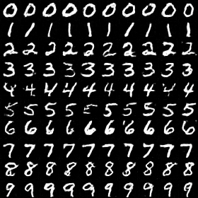

# MNIST diffusion speedrun

A runnable inference exercise with a trained conditional generator, a frozen
MNIST evaluator, fixed real-data statistics, and a student notebook. No training
or dataset download is needed for sampling and scoring.

Open [MNIST_SPEEDRUN.ipynb](MNIST_SPEEDRUN.ipynb). The
[executed example](MNIST_SPEEDRUN.executed.ipynb) includes the image grids and a
10,000-image scorecard. The [course specification](SPEC.md)
explains the challenge and submission.

## Run it

From the repository root, in a Python environment with PyTorch:

```sh
python -m pip install -r speedrun/requirements.txt
python speedrun/benchmark.py --order heun --steps 4 --repeats 1 \
  --out speedrun/results/local/heun4.json
```

The command generates 10,000 balanced digit requests, warms up the sampler,
and saves a JSON scorecard and a digit grid. It selects
CUDA, Apple MPS, or CPU automatically; use `--device cpu` to choose explicitly.
For median timing, use `--repeats 3` (the CLI default). Sampling time excludes
model loading and evaluator scoring. A single run is sufficient to try the
exercise; compare timing only on the same hardware.

For a quick installation check, add `--n 100 --repeats 1`. The notebook starts
with a 100-image preview and then scores 10,000 images for the practice band.

## Frozen scoring

The trained generator, evaluator, and reference statistics are included under
`checkpoints/` (about 9 MB total). Comparisons use fixed weights and the same
initial noise samples.

- **FID-M:** Gaussian Fréchet distance in the evaluator's 128-dimensional
  post-ReLU representation. Preprocessing is grayscale 28×28, scaled to [-1,1].
  The reference uses all 60,000 MNIST training images, with float64 covariance
  and a fixed 1e-6 ridge.
- **Requested-digit agreement** (the scorecard's `accuracy` field): fraction
  the frozen classifier labels as the requested digit. For example, request a
  7 and count success if the classifier predicts 7. **Target confidence** is
  its mean probability for the requested digit.
- **Nonduplicate fraction:** fraction whose closest other generated sample is
  farther than the fixed real-data threshold.
- **NFE:** conditional and unconditional predictions per generated image.
  A combined two-branch batch still costs two evaluations.

Separately, the evaluator has 99.32% accuracy on labeled real test images.
Against the frozen training reference,
the full 10,000-image test set has FID-M 5.5844. The
[evaluator checks](results/evaluator-validation.json) also verify increasing
scores under progressive blur and zero nonduplicate fraction for a repeated
image.

The generator is the existing 15-minute, 2,942-step EMA checkpoint. The
[reference scorecard](results/reference-seed0.json) records 16-step DDIM with
`w=2`, seed 0, and 10,000 samples: FID-M **91.13**, digit agreement **99.81%**,
nonduplicate fraction **96.89%**, **32 NFE**. One measured sampling run took
181 seconds on this Mac's MPS device.

The executed notebook's [4-step Heun example](results/heun4-seed0.json) uses
**14 NFE** and scores FID-M **79.29**, digit agreement **99.78%**, and nonduplicate
fraction **97.36%** on the same public seed. Its measured sampling time was
79 seconds. Both configurations pass the practice band.



Practice thresholds are FID-M ≤120, digit agreement ≥98%, and nonduplicate fraction
≥95%. A qualifying configuration with lower NFE wins; use three timing runs
for a same-device tie.

## Sampler conventions

The course clock runs from noise at `t=0` to data at `t=1`. Guidance is
`unconditional + w*(conditional - unconditional)`: `w=0` is unconditional,
`w=1` is conditional, and `w>1` extrapolates. The [deterministic-sampler note](../notebooks/toy_data/executed/02_denoisers_and_deterministic_samplers.ipynb)
provides the solver background. This optional exercise uses a separate,
class-conditional MNIST model; the main notes use an unconditional 2D model.

`ddim` follows the cosine clean/noise transport. `euler` and `heun` integrate the
implied velocity. All use a final clean-image prediction to avoid evaluating
the singular velocity at `t=1`. With `w=2`, DDIM/Euler cost `2*steps` NFE and
Heun costs `2*(2*steps-1)`. At `w=0` or `w=1`, only one branch is needed.
The stochastic knob `eta` is supported only for DDIM and uses the
[authors' DDIM variance formula](https://github.com/ermongroup/ddim/blob/main/functions/denoising.py).
The time grid, batch size, noise seeds, and sample count are fixed for comparisons.

## Instructor checks and training

```sh
python speedrun/test_speedrun.py
python speedrun/validate.py --device cpu
```

`test_speedrun.py` checks the samplers and scoring. `validate.py` checks the
evaluator on MNIST and downloads the dataset if needed.

`train_evaluator.py` and `train_diffusion.py` are optional instructor training
scripts. They save new models under `checkpoints/training/`. The distributed
weights define the speedrun baseline. `freeze_reference.py` computes the
real-data reference statistics when preparing a new release.
